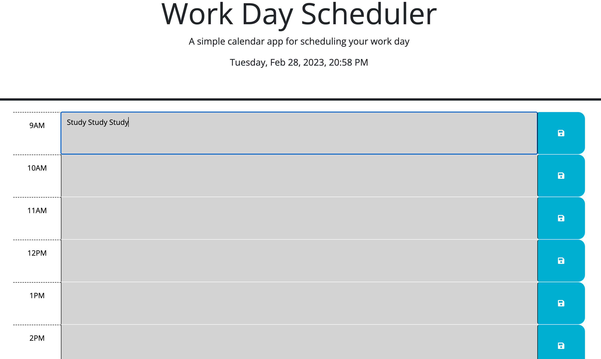

# Event-Planner

## Description
This Event Scheduler was designed for a typical work day 9am to 17pm to help you keep track of task needing to be completed by a certain hour, or just a simple reminder. In this project  I learned to use JQuery Dom Traversal , setting items to local storage, getting items out of local storage to stay rendered to the page, using the data attribute, and learning how to properly use the "this" keyword.

## Installation
No insallation needed, site is up and ready to use. 

## Usage
Need a scheduler to help you stay on track during your work day? Simply add a task to which ever hour you choose, click save and your task along with the hour will be added to local storage. The hours will change color automatically corosponding to past, present, or future time. 

<a href="https://kr1istin.github.io/Event-Planner/">Event Scheduler Site</a>

## License
N/A